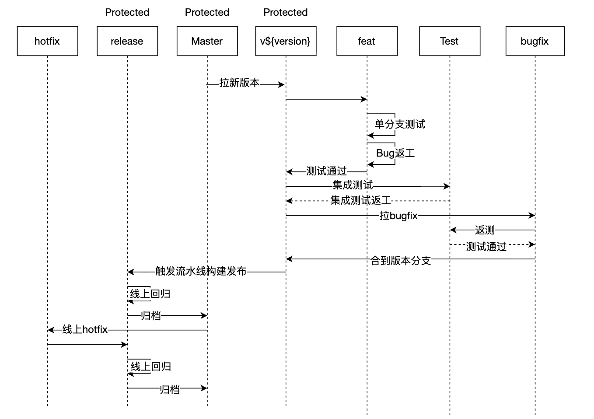

# 项目结构

[文档](https://doc.weixin.qq.com/doc/w3_AV8AKQYSAN8CN1Qh6K5DUSKKMGv4y?scode=AJEAIQdfAAoXf47rjjAV8AKQYSAN8)

- dev：开发调试的代码
- docs：文档
- packages：项目源码目录
- scripts：构建或工具脚本
- public: vite目录
- submodules：子模块目录，子模块通过vite alias配置和tsconfig配置来链接

# 单个包目录结构

- npm：构建npm产物
- src：源码目录

# 脚本

## 创建一个新的包

pnpm create-pkg {pkgName} {dep1,dep2,...}

如
// pnpm create-pkg {dir/pkgName} {dep1,dep2,...}
// pnpm create-pkg libs/utils test

## 运行本地调试

pnpm run dev

## 构建

# 分支规范

- master 主分支
- release 发布分支
- test 集成测试分支
- v{version} 版本分支
- feat/{version}/{feature}-{tapd_id} : 功能分支
- bugfix/{bug}-{tapd_id}: 集成测试修复分支
- hotfix/{bug}-{tapd_id} : 热修复分支

# 工具

## 构建工具

pnpm + vite + vitest + 子模块

## 代码规范

- Typescript + Eslint： typescript-eslint
- Vue：eslint-plugin-vue

使用 Eslint 进行代码自动补全规范

## 单元测试

vitest

## 添加子模块

git submodule add {repo.git} submodules/name

## 

## 开发说明请参见 docs 目录

